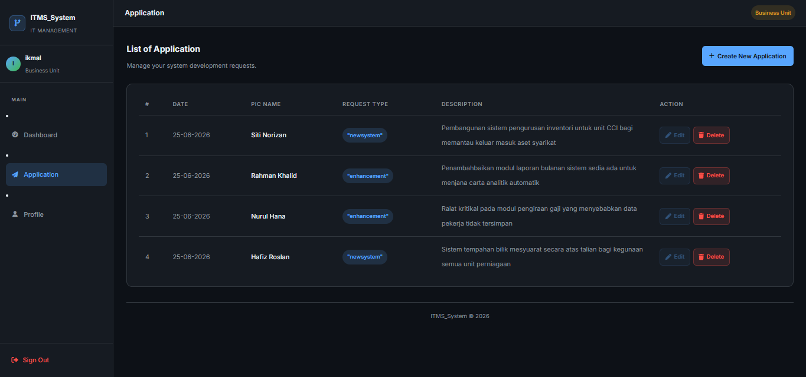

# ITMS — IT Management System

A web-based IT Management System built with **Laravel 10** for managing IT project assignments, tracking development progress, and coordinating between managers, developers, and business units.



---

## Features

- **Role-based access** — Manager, Developer, and Business Unit roles with different permissions
- **Project management** — Assign projects to business units with start/end dates, methodology, platform, and deployment type
- **Developer assignment** — Attach and detach developers to projects
- **Progress tracking** — Developers can update project status (Ahead of Schedule, On Schedule, Delayed, Completed)
- **Business Unit requests** — BU users can submit, edit, and delete system development requests
- **Dark mode UI** — Clean, modern dark interface built without external CSS frameworks

---

## Tech Stack

| Layer | Technology |
|-------|-----------|
| Backend | Laravel 10 (PHP 8.2) |
| Frontend | Blade Templates, Vite |
| Database | MySQL |
| Auth | Laravel Auth |

---

## User Roles

| Role | usertype | Access |
|------|----------|--------|
| Manager | `0` | Full access — assign projects, manage developers, view all |
| Business Unit | `1` | Submit requests, view own applications, manage profile |
| Developer | `2` | View assigned projects, update progress |

---

## Getting Started

### Prerequisites
- PHP 8.1+
- Composer
- Node.js & npm
- MySQL (XAMPP / WAMP)

### Installation

**1. Clone the repository**
```bash
git clone https://github.com/IkmalAzis/itmsdev.git
cd itmsdev
```

**2. Install dependencies**
```bash
composer install
npm install
```

**3. Setup environment**
```bash
cp .env.example .env
php artisan key:generate
```

**4. Configure database**

Edit `.env` and set your database credentials:
```
DB_DATABASE=itmsdev
DB_USERNAME=root
DB_PASSWORD=your_password
```

**5. Run migrations**
```bash
php artisan migrate
```

**6. Start the development server**

Open two terminals:

```bash
# Terminal 1 — Vite (frontend assets)
npm run dev

# Terminal 2 — Laravel server
php artisan serve
```

**7. Open in browser**
```
http://localhost:8000/login
```

---

## Default Setup

After registering, set user roles manually in the database (`users` table → `usertype` column):

| Value | Role |
|-------|------|
| `0` | Manager |
| `1` | Business Unit |
| `2` | Developer |

---

## License

This project is open-sourced for educational purposes.
